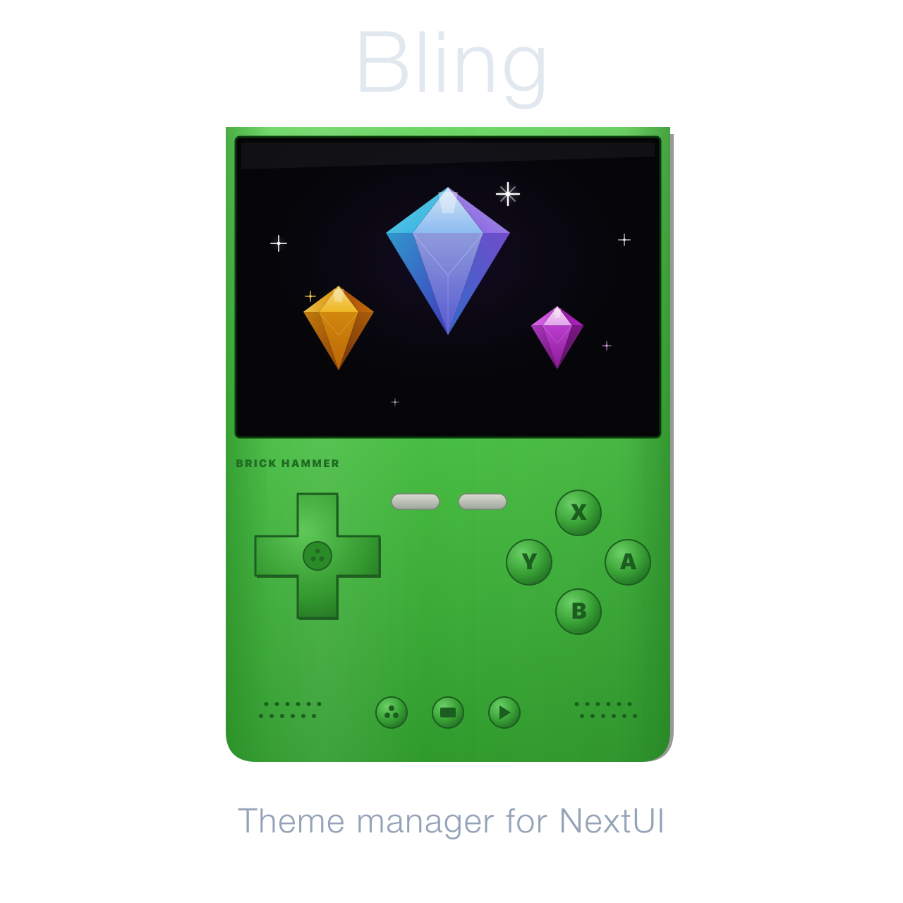
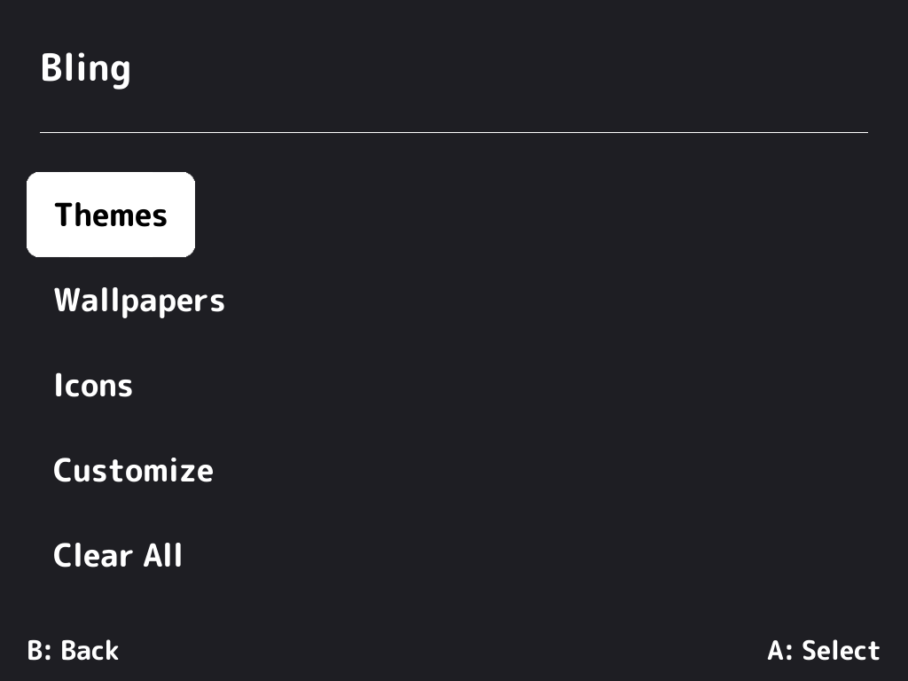
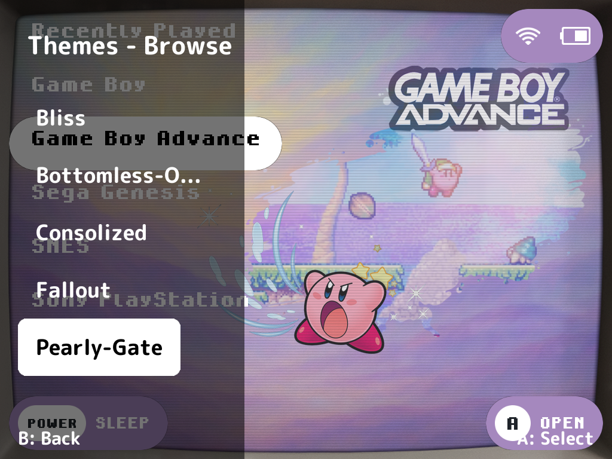
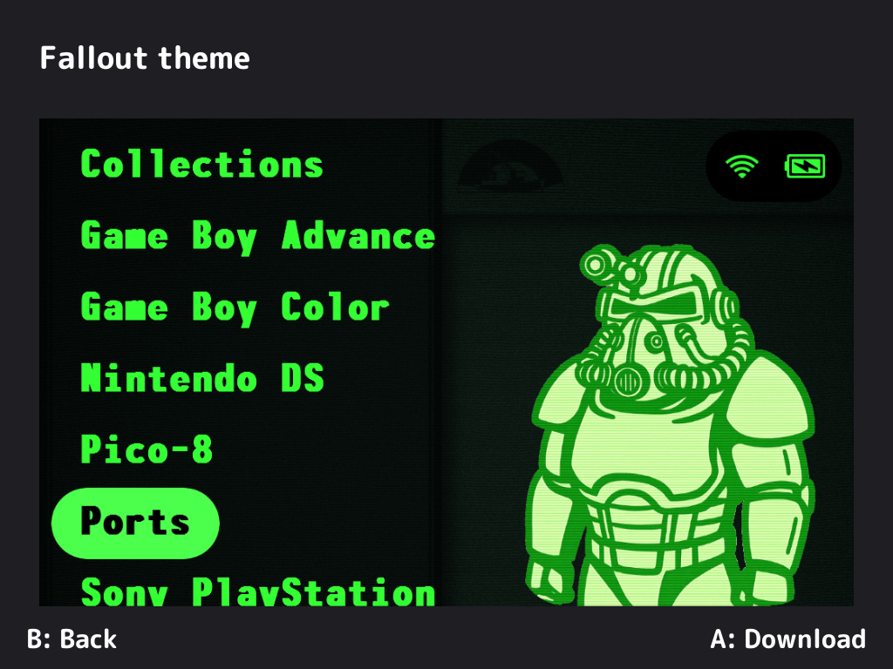
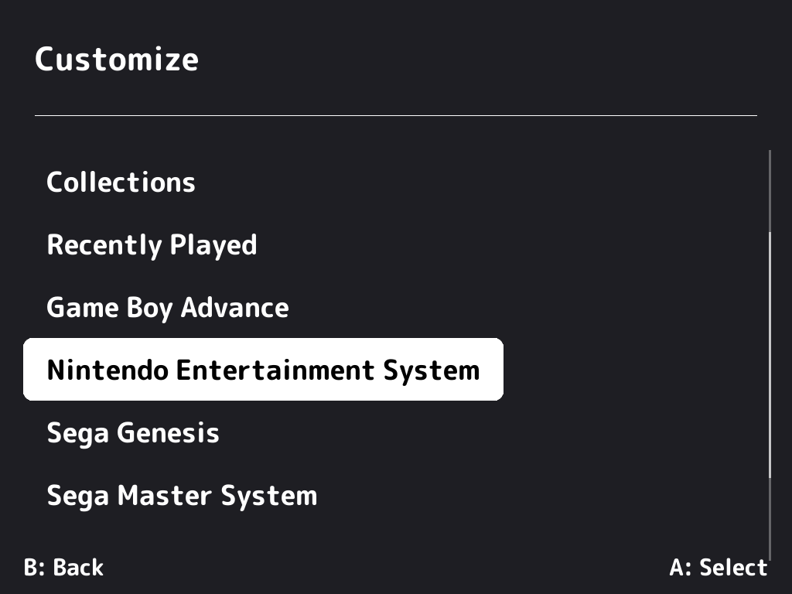

<div align="center">

# Bling



[](https://github.com/ericreinsmidt/nextui-bling/releases)
[](https://github.com/ericreinsmidt/nextui-bling/releases)
[](LICENSE)

A theme manager for [NextUI](https://github.com/LoveRetro/NextUI) on TrimUI handhelds.

</div>

Browse, download, and apply community-made wallpaper and icon themes directly on your device. Mix and match individual wallpapers and icons per system for a fully custom setup.

## Screenshots

| Main Menu | Browse | Detail | Customize |
|:-:|:-:|:-:|:-:|
|  |  |  |  |

## Supported Devices

- **tg5040** — TrimUI Brick, Smart Pro
- **tg5050** — TrimUI Smart Pro S

## Features

- **Browse** themes from a community catalog with live preview images
- **Download and install** themes with one button
- **Apply** full theme packs, wallpaper sets, or icon sets
- **Customize** — mix and match wallpapers and icons per system from any installed theme
- **Clear** individual wallpapers or icons to revert to defaults
- **Backup and restore** your current theme before making changes
- **Async preview loading** — previews download in the background and cache as you scroll
- **Delete** installed themes to free up space

## How It Works

Bling fetches a theme catalog from GitHub when you launch it. You can browse available themes, see previews, download them, and apply them to your device. Each theme can include wallpapers (menu backgrounds and game list backgrounds) and icons (system icons on the main menu).

Before applying a theme, the app automatically backs up your current wallpapers and icons so you can restore them later.

## Menu Structure

- **Themes** — full packages with both wallpapers and icons
- **Wallpapers** — wallpaper packs (menu backgrounds)
- **Icons** — icon packs (system icons)
- **Customize** — per-system mix and match from installed themes
- **Clear All** — remove all custom wallpapers and icons
- **Restore Backup** — revert to your original theme

## Installation

### Manual Installation

1. Download the latest `.pakz` from the [Releases](https://github.com/ericreinsmidt/nextui-bling/releases) page
2. Extract and copy the `Tools/` folder to your SD card root — it contains builds for all supported platforms
3. Launch from the Tools menu

## Creating Themes

Want to make a theme? Check the [Theme Catalog](https://github.com/ericreinsmidt/nextui-theme-catalog) for submission instructions and a full guide on theme structure.

## Building from Source

Requires Docker and the NextUI toolchain images.

```bash
make build          # Build for all platforms (tg5040 + tg5050)
make build-tg5040   # Build for Brick / Smart Pro only
make build-tg5050   # Build for Smart Pro S only
make package        # Build + package into dist/Bling.pakz
make clean          # Remove build artifacts
```

## Credits

Built with [Apostrophe](https://github.com/Helaas/Apostrophe) and [PakKit](https://github.com/ericreinsmidt/pakkit).

## License

MIT
